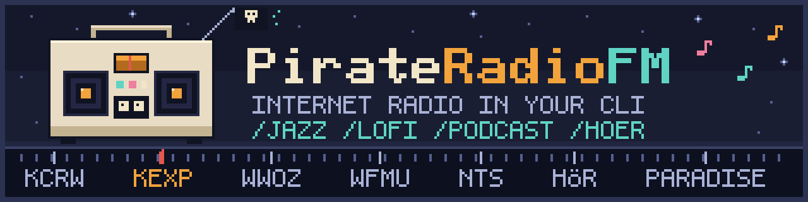

<p align="center"></p>

# PirateRadioFM

Play internet radio from a CLI coding agent. Music stops automatically when
the session ends.

[中文文档](./README.zh-CN.md)

## Install (Claude Code)

Requires Node.js 20+ and `mpv` (or `ffplay`):

- Windows: `winget install mpv`
- macOS: `brew install mpv`
- Linux: `sudo apt install mpv`

```bash
claude plugin marketplace add ziwangprincex/PirateRadioFM
claude plugin install radiohead@radiohead
```

Restart Claude Code. Type `/` in a new session to see the commands.

Uninstall:

```bash
claude plugin uninstall radiohead
claude plugin marketplace remove radiohead
```

## Install (Codex / OpenCode / Hermes / pi)

```bash
git clone https://github.com/ziwangprincex/PirateRadioFM
cd PirateRadioFM
node install.mjs
```

With no arguments it configures every agent found on the machine. To pick one:
`node install.mjs codex` (or `opencode`, `hermes`, `pi`). To remove everything
it wrote: `node install.mjs --uninstall`. Restart the agent after installing.

What it writes:

- Codex: MCP server in `~/.codex/config.toml`, prompts in `~/.codex/prompts/`
- OpenCode: MCP server in `~/.config/opencode/opencode.json`, commands in `~/.config/opencode/commands/`
- Hermes: MCP server in `~/.hermes/config.yaml`
- pi: prompt templates in `~/.pi/agent/prompts/`, skill in `~/.pi/agent/skills/radiohead/`

pi does not support MCP, so commands there call `dist/cli.js` directly and
music does not stop when the session ends. Use `/stop`.

## Commands

### Genre stations

| Command | Plays |
|---|---|
| `/jazz` | Jazz |
| `/classical` | Classical |
| `/indie` | Indie |
| `/rock` | Rock |
| `/country` | Country |
| `/pop` | Pop |
| `/ambient` | Ambient |
| `/lofi` | Lo-fi beats |
| `/soul` | Soul |
| `/eighties` | 80s |
| `/world` | World |
| `/house` | House |
| `/techno` | Techno / IDM |

### DJ / public stations

| Command | Station |
|---|---|
| `/kexp` | KEXP 90.3 Seattle |
| `/kcrw` | KCRW Eclectic24, Los Angeles |
| `/wfmu` | WFMU freeform, New Jersey |
| `/nts` | NTS London |
| `/wwoz` | WWOZ New Orleans, jazz & blues |
| `/paradise` | Radio Paradise |
| `/npr` | NPR music stations — The Current, WXPN, KUTX, WFUV (`/next` cycles) |
| `/hoer` | HÖR Berlin — live DJ stream when on air, latest set otherwise ([setup](./docs/sources.md#hör-berlin)) |

### Playback control

| Command | What it does |
|---|---|
| `/play` | Play jazz radio, or resume if paused |
| `/pause` | Pause |
| `/resume` | Resume |
| `/stop` | Stop. Unlike pause, this can't be resumed |
| `/next` | Next station / channel / track |
| `/prev` | Previous station / channel / track |
| `/volume <0-100>` | Set volume |
| `/now-playing` | Show what's playing |
| `/doctor` | Diagnose playback problems (player, yt-dlp, Spotify, streams) |

`/nts`, `/paradise`, and `/npr` have several channels; `/next` cycles through them.

### Podcasts & streaming

| Command | What it does |
|---|---|
| `/podcast <name-or-rss-url>` | Play a podcast's newest episode (searched on iTunes, no login); `/next`/`/prev` step through episodes |
| `/music <name>` | Play a playlist/song/album from your Apple Music library (macOS only) |
| `/spotify-play <anything>` | Play a track/album/playlist/show on your Spotify client (Premium + setup) |
| `/spotify-search <query>` | Search the Spotify catalog |
| `/spotify-devices` / `/spotify-device <name>` | List Spotify devices / move playback |

Spotify needs a one-time setup (developer app + login); details and limits for
all three sources are in [docs/sources.md](./docs/sources.md).

Plain language also works: "play some jazz", "switch station", "stop the music".
